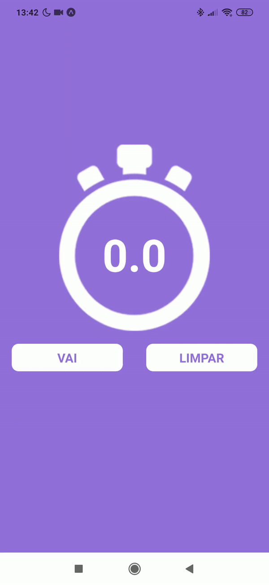

# Cronometer-JS-
 
PT - Esse aplicativo foi desenvolvido usando React Native e Expo, no curso do Sujeito Porgramador. De forma inicial foi desenvolvido usando classes (CronometerWithClass.js) e depois eu desenvolvi utilizando o React Hooks  
 

EN - This app was desenvolved using React Native and Expo, on Sujeito Programador´s course. In the beggining it was desenvolved using classes (CronometerWithClass.js) and later I desenvolved the same App using React Hooks. 
 

